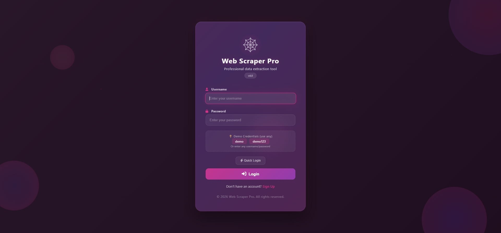
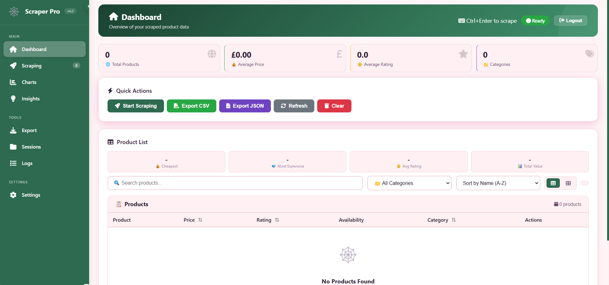
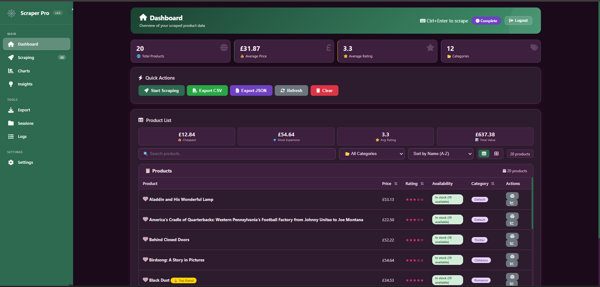
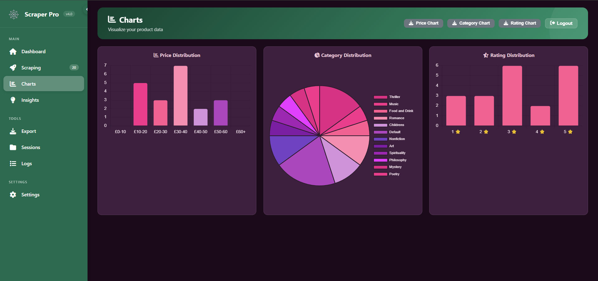
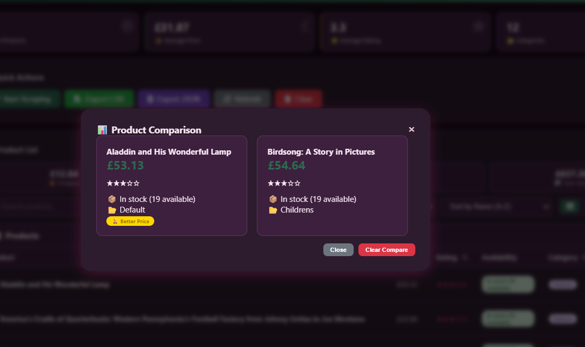
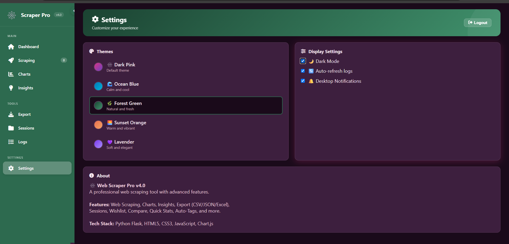
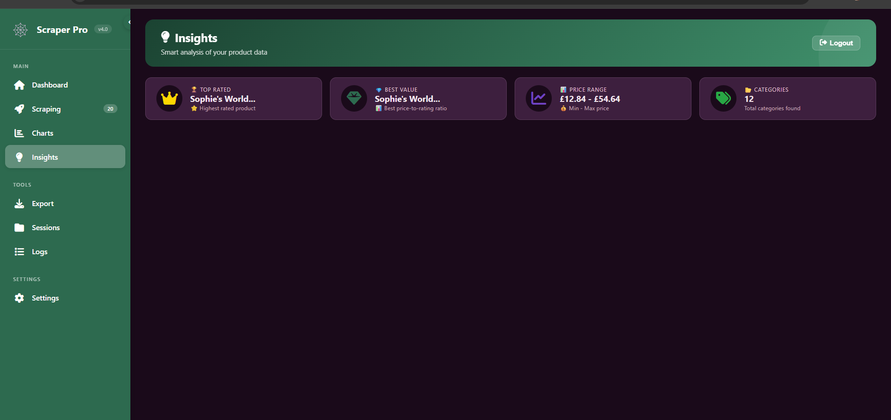
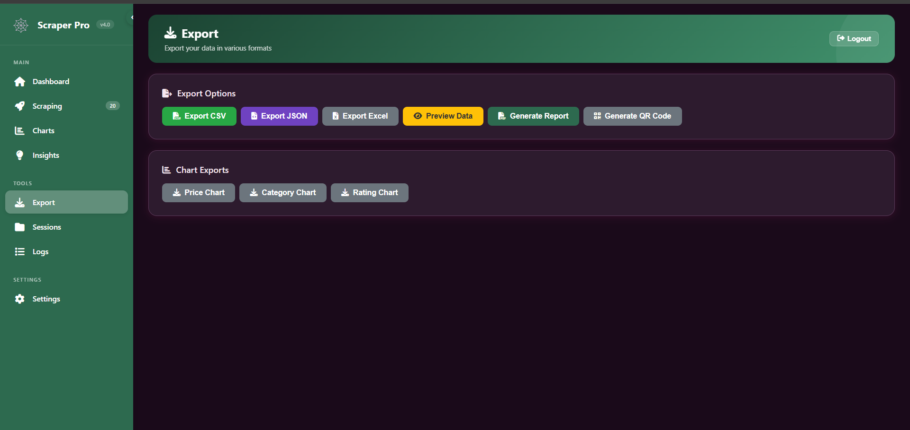
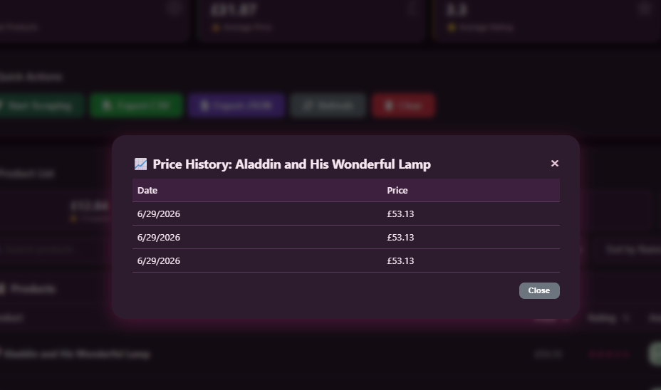
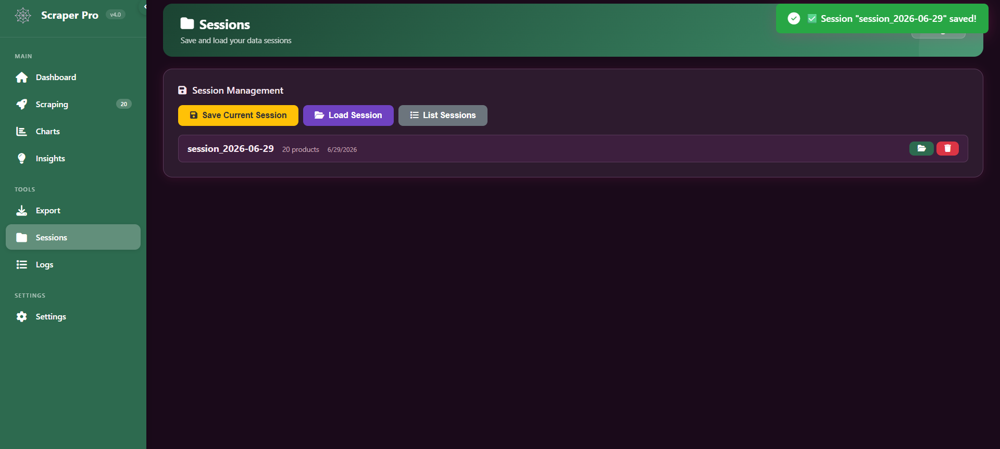

<div align="center">

# 🕸️ Web Scraper Pro

### *Professional Web Scraping & Data Analytics Platform*

[](https://www.python.org/)
[](https://flask.palletsprojects.com/)
[](LICENSE)
[](https://github.com/yourusername/web-scraper-pro/pulls)

</div>

---

## 🌟 **About The Project**

Web Scraper Pro is a **feature-rich, production-ready web scraping application** that transforms raw web data into actionable insights. Built with Python Flask and modern web technologies, it offers a seamless experience for extracting, visualizing, and exporting product data.

### 🎯 **Why Web Scraper Pro?**

- 🔥 **No-code scraping** - Just enter a URL and click start
- 📊 **Real-time analytics** - Watch data come alive with interactive charts
- 🎨 **Beautiful UI** - 5 stunning themes with dark mode
- 📱 **Fully responsive** - Works on desktop, tablet, and mobile
- 🔒 **Secure** - Built-in authentication and session management

---

## ✨ **Key Features**

### 🔐 **Authentication & Security**
- 🚪 Secure login with glass-morphism UI
- 👤 User session management
- 🔑 Demo credentials for quick testing

### 🕷️ **Web Scraping Engine**
- 🌐 Scrape any valid URL
- 📄 Multi-page pagination support
- 📦 Batch processing with max product limits
- 📊 Real-time progress tracking
- 📋 Live logging system

### 📊 **Data Visualization**
- 📈 Price distribution charts
- 🥧 Category distribution charts
- ⭐ Rating distribution charts
- 🖼️ Export charts as PNG images

### 🔍 **Product Management**
- 🔎 Advanced search with autocomplete
- 📂 Smart category filtering
- 📊 Multiple sort options (Name, Price, Rating, Best Value)
- ❤️ Wishlist/Favorites system
- ⚖️ Side-by-side product comparison
- 🏷️ Auto-generated smart tags
- 📈 Price history tracking

### 📤 **Export & Reporting**
- 📊 CSV export
- 📄 JSON export
- 📈 Excel export
- 📄 HTML report generation
- 📱 QR code sharing

### 💾 **Data Persistence**
- 💾 Save sessions
- 📂 Load sessions
- 🗑️ Delete sessions
- 🔄 Auto-data refresh

### 🎨 **UI/UX Excellence**
- 🎨 5 unique themes:
  - 🕸️ Dark Pink (Default)
  - 🌊 Ocean Blue
  - 🌿 Forest Green
  - 🌅 Sunset Orange
  - 💜 Lavender
- 🌙 Dark mode toggle
- 📱 Fully responsive design
- 🖼️ Grid/Table view toggle
- 🔔 Desktop notifications
- ⌨️ Keyboard shortcuts (Ctrl+Enter)

---

## 🛠️ **Tech Stack**

<div align="center">

| Category | Technologies |
|----------|--------------|
| **Backend** | Python, Flask |
| **Scraping** | BeautifulSoup4, Requests |
| **Data Processing** | Pandas, NumPy |
| **Visualization** | Chart.js, Matplotlib |
| **Frontend** | HTML5, CSS3, JavaScript |
| **Icons** | Font Awesome |
| **Graphics** | Pillow, QRCode |
| **Database** | JSON (file-based) |

</div>

---

## 📸 **Screenshots**

<div align="center">

### 🔐 **Login Page**


### 🏠 **Dashboard**


### 📊 **After Scraping**


### 📈 **Charts & Analytics**


### ⚖️ **Product Comparison**


### 🌙 **Dark Mode**


### 💡 **Insights Dashboard**


### 📤 **Export Options**


### 📋 **Price History**


### 💾 **Sessions**


</div>

---

## 🚀 **Getting Started**

### 📋 **Prerequisites**

- Python 3.8 or higher
- pip (Python package manager)
- Git (optional)

### 💻 **Installation**

#### 1. **Clone the Repository**
git clone https://github.com/yourusername/web-scraper-pro.git
cd web-scraper-pro

#### 2. **Create Virtual Environment**
# Windows
python -m venv venv
venv\Scripts\activate

# Linux/macOS
python3 -m venv venv
source venv/bin/activate

#### 3.**Install Dependencies**
pip install -r requirements.txt

#### 4.**Run the Application**
python app_web.py

#### 5.**Open Browser**
Navigate to: http://127.0.0.1:5000
---
### 🔑 **Login Credentials**

| Field | Value |
|-------|-------|
| **Username** | `demo` |
| **Password** | `demo123` |

Or use any username/password - the system accepts any non-empty credentials!

---

## 📁 Project Structure

```text
web-scraper-pro/
│
├── 📁 templates/              # HTML templates
│   ├── index.html            # Main dashboard
│   └── login.html            # Login page
│
├── 📁 screenshots/            # Documentation screenshots
│   ├── login.png
│   ├── homebs.png
│   ├── afterscrap.png
│   ├── chart.png
│   ├── compare.png
│   ├── darkmode.png
│   ├── insights.png
│   ├── export.png
│   ├── pricehist.png
│   ├── scraps.png
│   └── sessions.png
│
├── 📄 app_web.py              # Main Flask application
├── 📄 ecommerce_scraper.py    # Core scraping logic
├── 📄 requirements.txt        # Python dependencies
├── 📄 README.md               # Documentation
├── 📄 .gitignore              # Git ignore file
├── 📄 analyze_categories.py   # Category analysis script
├── 📄 price_analysis.py       # Price analysis script
├── 📄 config.py               # Configuration file
├── 📄 setup.py1               # Setup script
├── 📄 summary.py1             # Summary script
└── 📄 setup.sh                # Linux setup script
```


---

## 🎯 **How to Use**

#1. Login
   - Navigate to http://127.0.0.1:5000
   - Enter username and password
   - Click "Login" or use "Quick Login"

#2. Scrape Products
   - Go to Scraping page from sidebar
   - Enter website URL (default: https://books.toscrape.com/catalogue/page-1.html)
   - Set max pages and max products
   - Click "Start Scraping"
   - Watch real-time progress and logs

#3. Explore Dashboard
   - Go to Dashboard page
   - View statistics: total products, average price, average rating, categories
   - Use search, filter, and sort options
   - Toggle between Table View and Grid View
   - ❤️ Click heart to add to wishlist
   - ⚖️ Click compare on 2 products

#4. View Charts
   - Go to Charts page
   - View price, category, and rating distributions
   - Click "Export Chart" to download as PNG

#5. Export Data
   - Go to Export page
   - Choose export format: CSV, JSON, Excel
   - Generate HTML report or QR code

#6. Manage Sessions
   - Go to Sessions page
   - Save current session with a name
   - Load any saved session
   - Delete unwanted sessions

#7. Customize Settings
   - Go to Settings page
   - Choose from 5 themes
   - Toggle Dark Mode
   - Enable/disable Auto-refresh logs
   - Enable/disable Desktop Notifications

---

### ⌨️ **Keyboard Shortcuts**

| Shortcut | Action |
|----------|--------|
| `Ctrl + Enter` | Start scraping |
| `Esc` | Close modals |
---
### 🎨 **Themes Gallery**

| Theme | Preview | Description |
|-------|---------|-------------|
| **🕸️ Dark Pink** | 🌸 | Default theme with elegant pink gradients |
| **🌊 Ocean Blue** | 🌊 | Calming blue tones for focused work |
| **🌿 Forest Green** | 🌿 | Natural green shades for freshness |
| **🌅 Sunset Orange** | 🌅 | Warm orange hues for energy |
| **💜 Lavender** | 💜 | Soft purple tones for elegance |
---
### 🔧 **Troubleshooting**

| Issue | Solution |
|-------|----------|
| ❌ "No module named 'qrcode'" | `pip install qrcode pillow` |
| ❌ "No module named 'matplotlib'" | `pip install matplotlib` |
| ❌ Port 5000 already in use | Change port in `app_web.py` |

---
### 📦 **Dependencies**

| Package | Version | Purpose |
|---------|---------|---------|
| `requests` | 2.31.0 | HTTP requests |
| `beautifulsoup4` | 4.12.2 | HTML parsing |
| `lxml` | 4.9.3 | XML/HTML processing |
| `pandas` | 2.0.3 | Data manipulation |
| `flask` | 2.3.3 | Web framework |
| `openpyxl` | 3.1.2 | Excel export |
| `matplotlib` | 3.7.2 | Chart generation |
| `qrcode` | 7.4.2 | QR code generation |
| `Pillow` | 10.0.0 | Image processing |

---

## 👨‍💻 **Author**

**Sarudharshini B**

Software Development Intern — SkillCraft Technology

---

### 📝 **License**

This project is developed for educational and learning purposes as part of the SkillCraft Technology Software Development Internship.

### ⭐ **Show Your Support**
If you found this project useful, please give it a ⭐ on GitHub!
